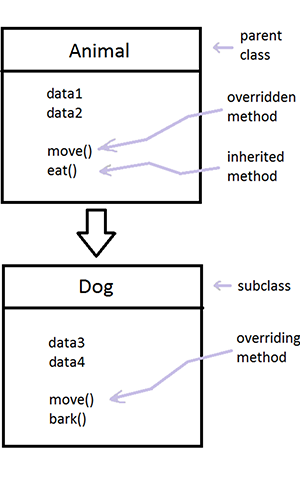

<!--#3c8f0d - blue -->
<!--#3c8f0d - green -->


># Abstraction:

### <span style="color: #3c8f0d;">What is the '_Abstract Method_ ' in C#?</span> 
- A method that does not have a body is called an abstract method. 
- It is declared with the modifier abstract. 
- It contains only a declaration/signature and does not contain the implementation/body/definition of the method. 
- '_Abstract class cannot be  **INSTANTIATED**._'
- An abstract function should be terminated with a semicolon. Overriding an abstract function is compulsory.
<br>


### <span style="color: #3c8f0d;">Need for Abstract Method in C#?</span>

- In a class, we are allowed only to define a class with the body.
- Since we are changing its default behavior (which means removing its body) it must have the abstract keyword in its prototype." 
- Abstract methods are usually declared where two or more subclasses are expected to fulfilla similar role in a different manner.
- Often the subclasses are required to fulfill an interface, so the abstract superclass might provide several of the interface methods, but leave the subclasses to implement their own variations of the abstract methods."


### <span style="color: #3c8f0d;">The Syntax: </span>
` abstract type method-name(parameter-list); `

Example:  `public abstract void m2();`

>As you can see, no method body is present. Any concrete class(i.e. class without abstract keyword) 
that extends an abstract class must override all the abstract methods of the class.


---


># Overriding:

### <span style="color: #3c8f0d;">What is Overriding?</span>
- In c#, the override modifier or keyword use with derived class method. 
- It is used to modify a virtual or abstract method into derived class which presents in base class.
- Method overriding is one of the ways by which C# achieve Run Time Polymorphism.
  

<span style="width:400px height:400px; ">

### <span style="color: #3c8f0d;">Need For Overriding in C#?</span>

- In C#, Override keyword are used for method overriding, literally.
- When a method in a derived class can have the same name,same parameters or signature and same return type as a method in the base class and it requires the same method to be executed then we need to override that method in the derived class from the base class by using override keyword.
- The override modifier extends the base class virtual method. Also we can specify how the methods interact by using the override keyword


### <span style="color: #3c8f0d;">How does Overriding Works?</span>

- In C#, for overriding, the base class method in a derived class, you have to declare a base class method as virtual or abstract and derived class method as override.
- An overriding property declaration must specify exactly the same access modifier, type, and name as the inherited property.
- Then the derived class will override the base class method, and executes the main method.The overridden base method must be virtual, abstract.
- You cannot override a non-virtual or static method. 
You cannot use the new, static, or virtual modifiers to modify an override method.

### <span style="color: #3c8f0d;">The Sytanx:</span>

```
class BaseClass
{
    public void Method()
    {
        //Code
    }
}
class DerivedClass : baseClass
{
    new public void Method()
    {
        //Code
    }
}
```
### <span style="color: #3c8f0d;">Example:</span>
```
using System;  
public class Animal{  
    public virtual void eat(){  
        Console.WriteLine("Eating...");  
    }  
}  
public class Dog: Animal  
{  
    public override void eat()  
    {  
        Console.WriteLine("Eating bread...");  
    }  
}  
public class TestOverriding  
{  
    public static void Main()  
    {  
        Dog d = new Dog();  
        d.eat();  
    }  
} 
```

---

># 'new' Keyword:
### <span style="color: #3c8f0d;">What is the 'new' Keyword in C#?</span>

- new keyword has several uses, it is used as an 
    - Operator
    - Modifier
    - Constraint


### <span style="color: #3c8f0d;">Need For 'new' in C#?</span>
- **'new' as an Operator:**
  - The new keyword can be used to create objects and invoke a constructor.
  - Lets say we have a class called Solution, then:
    <br>
    ` Solution Sol = new Solution();  `
    <br>
  - We can initialize collections as well, like:
    <br>
    `var Item = new List<items>();  `
    <br>
  - We cannot overload the "new" operator.

  - With "new" operator we can invoke the default constructor of a value type:<br>
    `Int num = new int();`
    <br>

- **'new' as a modifier:**
  - It hides a member that is inherited from a base class.

  - What are the consequences of not using 'new' here?
    Compiler gives a nasty Warning!

### <span style="color: #3c8f0d;">The Sytanx:</span>
```
public class BaseClass
{
    public void Method() { }
}
public class DerivedClass : BaseClass
{
    new public void Method() { }
}
```

### <span style="color: #3c8f0d;">Example:</span>

```
public class BaseClass
{
    public static int x = 10;
    public static int y = 20;
}

public class DerivedC : BaseC
{
    // Hide 'x'.
    new public static int x = 50;

    static void Main()
    {
        //new value of x:
        Console.WriteLine(x);

        //hidden value of x:
        Console.WriteLine(BaseClass.x);

        // Display y:
        Console.WriteLine(y);
    }
}
```
>***Output:***
*50
10
20*

---
</br>


## Abstract vs Override vs new Keyword


|**abstract** |  **override** | **new**|
|-------------|-----------------|----------------|
| In abstract method we only initiate function and not define it.| Using override we can override a method from parent class.             | new can be used to create a instance or to hide parent method.            |    
| We need it so that child class compulsorily overrides this(abstract) method.         | We need to override a particular method.          | We need it to hide method or create an object of a class.           |
| We use abstract keyword in class and in its method         | We only use override in methods             | We use it in creation of instance and to hide existing data member              |
| internal abstract void m2(); | internal override void m2(){}; | Solution Sol = new Solution();   **&&**  new public static int x = 50; |


